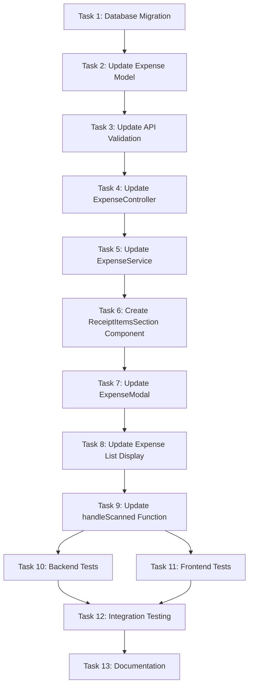

# Receipt Items Details Feature - Implementation Tasks

## Task Dependency Graph

---

## Task 1: Database Migration - Add receipt_items Column

**Description:** Create and run migration to add `receipt_items` JSON column to `expenses` table.

**Dependencies:** None

**Sub-tasks:**
1. Create migration file `YYYY_MM_DD_HHMMSS_add_receipt_items_to_expenses.php`
2. Add `receipt_items` column as nullable JSON after `description` column
3. Add rollback logic to drop column
4. Run migration in local environment
5. Verify column exists using `php artisan tinker` or database client
6. Test rollback with `php artisan migrate:rollback`

**Files to Create:**
- `backend/database/migrations/YYYY_MM_DD_HHMMSS_add_receipt_items_to_expenses.php`

**Acceptance Criteria:**
- Migration creates `receipt_items` column successfully
- Column is nullable and type JSON
- Rollback removes column without errors
- Existing expense records are not affected

---

## Task 2: Update Expense Model

**Description:** Update `Expense.php` model to support `receipt_items` with casting and accessor methods.

**Dependencies:** Task 1

**Sub-tasks:**
1. Add `receipt_items` to `$fillable` array
2. Add `receipt_items => 'array'` to `$casts` for auto JSON handling
3. Create `getItemCountAttribute()` accessor to return item count
4. Create `getIsScannedAttribute()` accessor to check if expense is from scan
5. Test model in tinker with sample receipt_items JSON

**Files to Modify:**
- `backend/app/Models/Expense.php`

**Acceptance Criteria:**
- Model accepts receipt_items in mass assignment
- JSON is automatically encoded/decoded
- Accessors return correct values
- No breaking changes to existing functionality

---

## Task 3: Update API Validation

**Description:** Add validation rules for `receipt_items` in `StoreExpenseRequest.php`.

**Dependencies:** Task 2

**Sub-tasks:**
1. Add `receipt_items` as nullable array to validation rules
2. Add nested validation for `receipt_items.items` array
3. Add nested validation for `receipt_items.fees` array
4. Add validation for numeric fields (subtotals, total)
5. Add validation for integer fields (itemCount, feeCount)
6. Test validation with valid and invalid payloads

**Files to Modify:**
- `backend/app/Http/Requests/StoreExpenseRequest.php`

**Acceptance Criteria:**
- Valid receipt_items pass validation
- Invalid JSON structure is rejected with clear error message
- Missing required fields are caught
- Manual expenses (no receipt_items) still work

---

## Task 4: Update ExpenseController

**Description:** Update `ExpenseController.php` to handle `receipt_items` in create and update methods.

**Dependencies:** Task 3

**Sub-tasks:**
1. In `store()` method, check if request has `receipt_items`
2. If present, add to `$data` array before passing to service
3. In `update()` method, check if request has `receipt_items`
4. If present, add to `$data` array before passing to service
5. Test POST /api/expenses with receipt_items
6. Test PUT /api/expenses/{id} with receipt_items

**Files to Modify:**
- `backend/app/Http/Controllers/ExpenseController.php`

**Acceptance Criteria:**
- POST with receipt_items creates expense successfully
- PUT with receipt_items updates expense successfully
- Response includes receipt_items in JSON
- Endpoints work without receipt_items (backward compatible)

---

## Task 5: Update ExpenseService

**Description:** Add receipt_items validation and error handling in `ExpenseService.php`.

**Dependencies:** Task 4

**Sub-tasks:**
1. Create `validateReceiptItems()` private method to check structure
2. Call validation in `create()` method if receipt_items present
3. Call validation in `update()` method if receipt_items present
4. Add try/catch for JSON parsing errors
5. Log errors with context for debugging
6. Test with valid and corrupted receipt_items

**Files to Modify:**
- `backend/app/Services/ExpenseService.php`

**Acceptance Criteria:**
- Valid receipt_items are saved without errors
- Invalid JSON structure throws clear exception
- Errors are logged with full context
- Service handles null/missing receipt_items gracefully

---

## Task 6: Create ReceiptItemsSection Component

**Description:** Create new Vue component to display receipt items with show/hide toggle.

**Dependencies:** Task 5 (backend must be ready for testing)

**Sub-tasks:**
1. Create `ReceiptItemsSection.vue` in `frontend/src/components/expense/`
2. Add props for `receiptItems` object
3. Add `isExpanded` ref (default: true)
4. Create `toggleExpanded()` method
5. Add template with header + toggle button
6. Add "Items" section with list of items (name, qty, price, subtotal)
7. Add "Other Charges" section with fees (amber background styling)
8. Add items subtotal (if fees exist)
9. Add total at bottom
10. Style with Tailwind matching existing design
11. Test component in isolation with mock data

**Files to Create:**
- `frontend/src/components/expense/ReceiptItemsSection.vue`

**Acceptance Criteria:**
- Component renders items and fees correctly
- Toggle button works (show/hide)
- Styling matches scan result modal
- Handles edge cases (empty arrays, missing fields)
- Responsive on mobile

---

## Task 7: Update ExpenseModal

**Description:** Update `ExpenseModal.vue` to store, send, and display receipt items.

**Dependencies:** Task 6

**Sub-tasks:**
1. Import `ReceiptItemsSection` component
2. Add `receipt_items: null` to `form` ref
3. Update `handleScanned()` to store receipt items in `form.receipt_items`
4. Update `watch` to load `receipt_items` when editing expense
5. Update `submit()` to include `receipt_items` in API payload
6. Add `<ReceiptItemsSection>` component to template (after wallet section)
7. Use `v-if="form.receipt_items"` to conditionally show section
8. Test scanning → saving → reopening expense
9. Verify receipt items display correctly

**Files to Modify:**
- `frontend/src/components/modals/ExpenseModal.vue`

**Acceptance Criteria:**
- Scanned receipts save with receipt_items
- Receipt items display when reopening expense
- Manual expenses don't show receipt items section
- Editing expense preserves receipt items
- Deleting expense removes receipt items

---

## Task 8: Update Expense List Display

**Description:** Update expense list to show item count for scanned receipts.

**Dependencies:** Task 7

**Sub-tasks:**
1. Find expense list component (e.g., `Expenses.vue` or similar)
2. Update expense title display logic
3. Check if `expense.receipt_items` exists and has `itemCount`
4. If yes, append ` - {count} item(s)` to title
5. Handle singular vs plural ("1 item" vs "2 items")
6. Test with scanned and manual expenses
7. Verify styling and spacing

**Files to Modify:**
- `frontend/src/views/Expenses.vue` (or equivalent expense list component)

**Acceptance Criteria:**
- Scanned expenses show "Groceries - 5 items"
- Manual expenses show "Groceries" (no item count)
- Singular/plural grammar is correct
- Styling is consistent with existing design

---

## Task 9: Update handleScanned Function

**Description:** Ensure `handleScanned()` in `ExpenseModal.vue` properly structures receipt_items.

**Dependencies:** Task 7

**Sub-tasks:**
1. Verify `handleScanned()` receives complete `scannedData` object
2. Build `receipt_items` object with all required fields
3. Include `items`, `fees`, subtotals, totals, counts
4. Add `merchantName` and `scannedAt` timestamp
5. Test with ROCKPOOL receipt
6. Verify all 5 items + service charge are included
7. Confirm total matches scanned total

**Files to Modify:**
- `frontend/src/components/modals/ExpenseModal.vue`

**Acceptance Criteria:**
- All receipt items are captured from scan
- JSON structure matches design spec
- `scannedAt` timestamp is ISO format
- No data loss during transfer

---

## Task 10: Backend Tests

**Description:** Write Feature tests for receipt_items functionality.

**Dependencies:** Task 5

**Sub-tasks:**
1. Create `ExpenseReceiptItemsTest.php` in `tests/Feature/`
2. Test: Store expense with receipt_items
3. Test: Store expense without receipt_items (manual)
4. Test: Update expense with receipt_items
5. Test: Retrieve expense with receipt_items
6. Test: Delete expense removes receipt_items
7. Test: Invalid receipt_items JSON is rejected
8. Test: receipt_items accessor methods work
9. Run `php artisan test` and verify all pass

**Files to Create:**
- `backend/tests/Feature/ExpenseReceiptItemsTest.php`

**Acceptance Criteria:**
- All tests pass
- Code coverage >80% for new code
- Tests cover happy path and error cases
- Tests are independent and repeatable

---

## Task 11: Frontend Tests

**Description:** Write unit tests for `ReceiptItemsSection.vue` component.

**Dependencies:** Task 6

**Sub-tasks:**
1. Create `ReceiptItemsSection.spec.js` in `tests/components/expense/`
2. Test: Component renders with items and fees
3. Test: Toggle button shows/hides items
4. Test: Button text changes ("Show Items" / "Hide Items")
5. Test: Default state is expanded
6. Test: Items subtotal displays when fees exist
7. Test: Other Charges section has amber styling
8. Run `npm run test:unit` and verify all pass

**Files to Create:**
- `frontend/tests/components/expense/ReceiptItemsSection.spec.js`

**Acceptance Criteria:**
- All tests pass
- Component behavior is fully tested
- Edge cases are covered
- Tests use Vue Test Utils properly

---

## Task 12: Integration Testing

**Description:** Perform end-to-end testing of complete receipt scanning → saving → viewing flow.

**Dependencies:** Task 10, Task 11

**Sub-tasks:**
1. Start backend server (`php artisan serve`)
2. Start frontend dev server (`npm run dev`)
3. Test Flow 1: Scan receipt → Save → View in expense modal
4. Test Flow 2: Scan receipt → Save → View in expense list
5. Test Flow 3: Edit scanned expense → Verify items preserved
6. Test Flow 4: Delete scanned expense → Verify items removed
7. Test Flow 5: Create manual expense → Verify no receipt items
8. Test on mobile device (responsive check)
9. Document any bugs found

**Acceptance Criteria:**
- All flows work end-to-end without errors
- Receipt items persist across page reloads
- UI is responsive on mobile
- No console errors or warnings
- Performance is acceptable (<500ms API, <200ms render)

---

## Task 13: Documentation

**Description:** Update project documentation for receipt items feature.

**Dependencies:** Task 12

**Sub-tasks:**
1. Update API documentation with receipt_items field
2. Add example request/response payloads
3. Document JSON structure for receipt_items
4. Add user guide for scanning receipts
5. Update database schema documentation
6. Add troubleshooting section for common issues
7. Review and proofread all documentation

**Files to Create/Modify:**
- `docs/API.md` or equivalent
- `docs/USER_GUIDE.md` or equivalent
- `README.md` (if feature overview needed)

**Acceptance Criteria:**
- Documentation is clear and accurate
- Examples are tested and work
- Screenshots/diagrams included if helpful
- No broken links or outdated information

---

## Summary

**Total Tasks:** 13  
**Estimated Time:** 3-4 days  
**Priority:** High  
**Complexity:** Medium

### Task Breakdown:
- **Backend:** Tasks 1-5, 10 (6 tasks)
- **Frontend:** Tasks 6-9, 11 (5 tasks)
- **Testing:** Tasks 10-12 (3 tasks)
- **Documentation:** Task 13 (1 task)

### Critical Path:
Task 1 → Task 2 → Task 3 → Task 4 → Task 5 → Task 6 → Task 7 → Task 9 → Task 12

All tasks must be completed in order due to dependencies.
